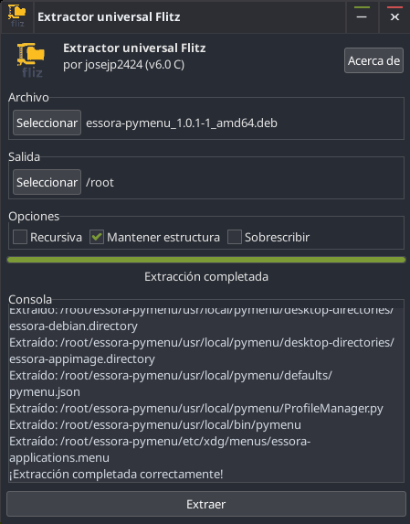
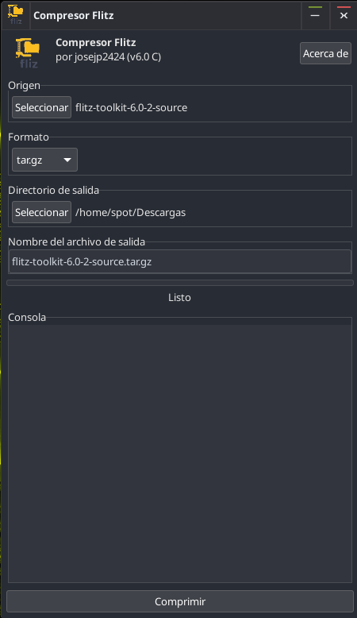

# Flitz Toolkit 6.0

<p align="center">
  
</p>

<p align="center">
  <strong>A lightweight archive compressor and extractor written in C and GTK3.</strong>
</p>


Created for Essora Linux, with support for Puppy Linux and Debian/Devuan-based systems.


The project provides two independent applications:

- **Flitz Extractor**
- **Flitz Compressor**

No Python, Tkinter, Pillow or `tkinterdnd2` runtime is required.

---

## Screenshots

<table>
  <tr>
    <td align="center"><strong>Flitz Extractor</strong></td>
    <td align="center"><strong>Flitz Compressor</strong></td>
  </tr>
  <tr>
    <td>
      
    </td>
    <td>
      
    </td>
  </tr>
</table>

---

## Main features

- Native implementation written in C and GTK3.
- Separate compressor and extractor applications.
- Native drag and drop in both windows.
- Integrated console output.
- Progress indication for archive operations.
- Automatic archive-format detection.
- Recursive extraction of archives found inside another archive.
- Optional preservation of directory structure.
- Overwrite controls.
- System-language detection.
- English as the default fallback language.
- Standard GNU Gettext translation support.
- ROX-Filer workflow compatibility.
- No `sudo` or `pkexec` requirement inside the applications.
- Simple About dialog with author, project and license information.
- GNU GPL version 3 or later.

---

## Supported extraction formats

Flitz Extractor supports common archives and several Linux package and image formats.

### Standard archives

- ZIP
- TAR
- TAR.GZ
- TAR.BZ2
- TAR.XZ
- GZip
- BZip2
- XZ
- Zstandard
- 7z
- RAR
- Multi-volume archives

### Packages and disk-image formats

- Puppy Linux PET
- Debian DEB
- RPM
- AppImage
- SFS
- SquashFS
- ISO
- DMG
- MSI
- CAB
- EXE and Inno Setup packages

The exact external command required for an optional format is reported when it is not installed.

---

## Supported compression formats

Flitz Compressor can create:

- `tar.gz`
- `tar.xz`
- ZIP
- 7z
- SquashFS

### SquashFS options

SquashFS creation includes controls for:

- Compression algorithm
- Block size
- XZ BCJ filter
- Additional `mksquashfs` parameters

---

## Puppy Linux PET support

Some Puppy Linux PET packages contain an MD5 checksum appended to the archive data.

Flitz Toolkit detects this checksum, separates it from the archive, verifies the package and then extracts the clean archive data.

This prevents valid PET files from incorrectly producing errors such as:

```text
xz: Compressed data is corrupt
tar: Child returned status 1
```

Older PET packages without the appended checksum remain supported.

---

## ROX-Filer integration

Opening an archive through `%f` starts extraction in the archive's own directory, matching the traditional ROX-Filer workflow.

The intentional ROX launcher link is preserved:

```text
/usr/local/flitz/flitz-extractor
    -> /usr/local/flitz/flitz-extractor.desktop
```

The native internal binaries are installed as:

```text
/usr/local/flitz/flitz-extractor-bin
/usr/local/flitz/flitz-compressor-bin
```

---

## Translations

Flitz Toolkit uses GNU Gettext catalogs installed in the standard system location:

```text
/usr/share/locale/<language>/LC_MESSAGES/flitz-toolkit.mo
```

Complete catalogs are included for:

- Arabic
- Catalan
- Chinese
- French
- German
- Hungarian
- Italian
- Japanese
- Portuguese
- Russian
- Spanish

English is the original interface language and the default fallback.

Editable translation sources are included in the `po` directory.

---

## Runtime dependencies

The graphical interface only requires GTK3 and GLib.

Archive utilities are used only when the selected format requires them.

| Format or function | Required command |
|---|---|
| Base TAR support | `tar` |
| ZIP creation | `zip` |
| ZIP extraction | `unzip` |
| 7z archives and ISO fallback | `7z` |
| RAR | `unrar` or `7z` |
| DEB | `dpkg-deb`, or `ar` and `tar` |
| RPM | `rpm2cpio` and `cpio` |
| DMG | `dmg2img` and `7z` |
| EXE/Inno Setup | `innoextract` or `7z` |
| MSI | `msiextract` |
| CAB | `cabextract` |
| SFS/SquashFS extraction | `unsquashfs` |
| SquashFS creation | `mksquashfs` |
| Zstandard | `zstd` |

Missing optional utilities do not prevent Flitz Toolkit from opening. Only the affected format or operation is unavailable.

---

## Build requirements

### Debian and Devuan

Install the required development packages:

```sh
apt install build-essential pkg-config libgtk-3-dev
```

### Puppy Linux

Load the matching `devx` SFS and make sure the GTK3 development headers are available.

---

## Compile from source

Clone the repository and enter its directory:

```sh
git clone https://github.com/USERNAME/flitz-toolkit.git
cd flitz-toolkit
```

Compile the applications:

```sh
make
```

Clean the build files:

```sh
make clean
```

---

## Install manually

To install under `/usr/local`:

```sh
make install
```

To install into a temporary package root:

```sh
make DESTDIR="$PWD/package-root" PREFIX=/usr/local install
```

---

## Build the Debian package

Run:

```sh
./build-package.sh
```

The generated package contains no Python runtime dependency.

Package name:

```text
flitz-toolkit
```

Generated filename:

```text
flitz-toolkit_6.0-2_<architecture>.deb
```

Example for AMD64:

```text
flitz-toolkit_6.0-2_amd64.deb
```

---

## Installation layout

```text
/usr/local/flitz/
├── flitz-extractor-bin
├── flitz-compressor-bin
├── flitz-extractor.desktop
└── flitz-extractor -> flitz-extractor.desktop

/usr/local/bin/
├── flitz-extractor
└── flitz-compressor

/usr/share/applications/
├── flitz-extractor.desktop
└── flitz-compressor.desktop

/usr/share/locale/
└── <language>/LC_MESSAGES/flitz-toolkit.mo
```

Additional icons and project resources are installed according to the Makefile.

---

## Repository structure

A typical source tree contains:

```text
flitz-toolkit/
├── README.md
├── LICENSE
├── Makefile
├── build-package.sh
├── data/
│   └── Flitz.png
├── screenshot/
│   ├── flitz-extractor.png
│   └── flitz-compresor.png
├── po/
├── src/
└── locale/
```

---

## About

Flitz Toolkit was created by **josejp2424** for **Essora Linux**.

Both applications include a simple About dialog showing:

- Application name and version
- Author: `josejp2424`
- Created for Essora Linux
- GNU GPL version 3 license

---

## License

Flitz Toolkit is free software released under the:

**GNU General Public License version 3 or later**

See the [`LICENSE`](LICENSE) file for the complete license text.

